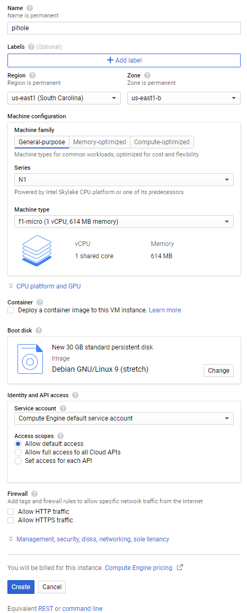
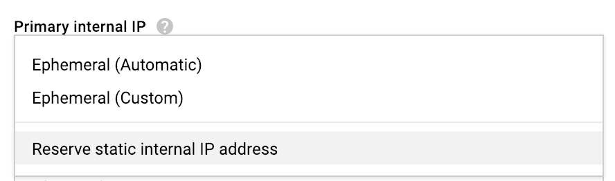
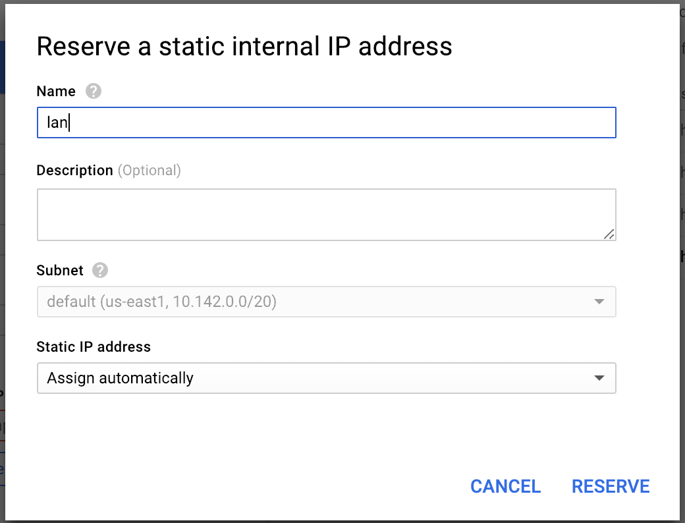

# work in progress - check back often

# Pi-Hole and PiVPN on Google Compute Engine Free Tier with Full Tunnel and Split Tunnel OpenVPN Configurations


The goal of this guide is to enable you to safely and privately use the Internet on your phone without intrusive advertisements, and blocking your ISP, mobile carrier, or public Wi-Fi hotspot provider from gaining insight into your usage activity.


Run your own privacy-first ad blocking service within the [Free Usage Tier](https://cloud.google.com/free/) on Google Cloud. This guide gets you set up with a Google Cloud account, and walks you through setting up a full tunnel (all traffic) or split tunnel (DNS traffic only) VPN connection on your Android Phone.

| Tunnel Type | Data Usage | Security | Ad Blocking |
| -- | -- | -- | -- |
| full | 10% more data usage | 100% encryption | yes
| split | least data usage | DNS encryption only | yes

---


# Google Cloud Login and Account Creation

Go to https://cloud.google.com and click **Console** at the top right if you have previously used Google's Cloud Services, or click **Try Free** if it's your first time.

 ### Account Creation
 - **Step 1 of 2** <br> Agree to the terms and continue. <br>
 - **Step 2 of 2** <br> Set up a payments profile and continue <br>
 ### Project & Compute Engine Creation
 - Click the Hamburger Menu at the top left: <br>
 - Click **Compute Engine**: <br>
 - Select **VM instances**: <br>
 - Create a Project if you don't already have one: <br>
- Enable billing for this Project if you haven't already: <br>
- Compute Engine will begin initializing: <br>


# Compute Engine Steps

- Create a Virtual Machine instance on Compute Engine: <br>
- Customize the instance: <br>
- Use Static IPs: <br>
- <br>
- <br>
- <br>
- <br>
- <br>
- <br>


# Debian Steps

```
sudo su
apt-get update && apt-get upgrade -y
```


# Pi-Hole Steps

```
curl -sSL https://install.pi-hole.net | bash
```

You will flow into a series of prompts in a blue screen.

- Choose OK or answer positively for all the prompts until the "Select Protocols" question appears. IPv6 needs to be deselected as shown below: <br>

Choose OK or answer positively for all the other prompts.

- Go to the Web Interface, log in, and <br>


# PiVPN Steps

```
curl -L https://install.pivpn.io | bash
```

You will flow into a series of prompts in a blue screen. All of the default values are appropriate. Choose OK or answer positively for all the prompts until you have to choose an upstream DNS provider. The default answer is Google. Choose **Custom** and set an IP Address of **10.8.0.1**

The default answer to reboot is **No** at the end of the installer. It is fine to say **No**, we have a few more things to edit while we're logged in as root.


# OpenVPN Steps

Get into the openvpn directory:

```
cd /etc/openvpn
```

I prefer to use **nano**, so the command would be:

```
nano server.conf
```

Comment out the line which reads `push "redirect-gateway def1"` so it reads as follows:

```
# push "redirect-gateway def1"
```

The longer the keep-alive interval the longer it will take either end of the openvpn connection to detect whether the connection is no longer alive. Because mobile devices often lose connectivity and regain it, lower values are desirable.

Comment out `keepalive 1800 3600` and add `keepalive 10 120` below it, so it appears as follows:

```
# keepalive 1800 3600
keepalive 10 120
```

Comment out the line which reads `cipher AES-256-CBC` and add `cipher AES-128-GCM` below it, so it reads as follows:

```
# cipher AES-256-CBC
cipher AES-128-GCM
```

At the bottom of the file add the following lines:

```
# performance stuff
fast-io
compress lz4-v2
push "compress lz4-v2"
```

Press `CTRL`+`O` to bring up the save prompt at the bottom of Nano, press **Enter** to save. Then press `CTRL`+`X` to exit


To accept incoming OpenVPN connections over TCP on port 443:

```
cd /etc/openvpn/
cp server.conf server_tcp443.conf
```

`nano server_tcp443.conf` and make these edits:

Replace the `proto udp` and `port 1194` lines with:

```
proto tcp
port 443
```

Edit the `server 10.8.0.0 255.255.255.0` line to reflect an IP address of **10.9.0.0**

```
server 10.9.0.0 255.255.255.0
```

Above the line `push "dhcp-option DNS 10.8.0.1"` add this line so it reads as follows:

```
push "route 10.8.0.1"
push "dhcp-option DNS 10.8.0.1"
```

Comment out `fast-io` so it looks like this:

```
# fast-io
```

Add the OpenVPN service on Port 443:

```
systemctl enable openvpn@server_tcp443.service
```

Reboot the server with this shutdown command:

```
shutdown -r now
```


# OpenVPN for Android

<a href="https://f-droid.org/repository/browse/?fdid=de.blinkt.openvpn" target="_blank">
</a>
<a href="https://play.google.com/store/apps/details?id=de.blinkt.openvpn" target="_blank">
</a>

When the app opens you are in the **Profiles** Tab. Import your Profile, click the `+` at the top right. Then click **Import** at the bottom left of the modal that appears. Click the Hamburger Menu at the top left to choose **Google Drive**, or your **Downloads** folder, depending on what method you used to get the **.ovpn** file to your phone.

Click the pencil icon next to the VPN profile you imported. Click the **Routing** Tab.

Click **Excluded Networks** under IPv4 and add this:

```
10.0.0.8/8 172.16.0.0/12 192.168.0.0/16
```

**Bypass VPN for local networks** should NOT have a checkmark. Uncheck it.

Under the **Authentication/Encryption** Tab

The **Encryption Cipher** should be `AES-128-GCM`

Under the **Allowed Apps** Tab the **Duo** app and **Google Play Store** and all 3 Phone apps, **Phone**, **Phone Messages** and **Phone Services** apps should be checked.

Click the back button a couple times until you are at the Profiles tab again.

Clicking the name of the VPN profile you imported should trigger a connection.

Click the **Settings** Tab:
- **OpenVPN 3 Core** should have a checkmark
- click **Default VPN** and choose the VPN you have imported
- **Connect on Boot** should have a checkmark